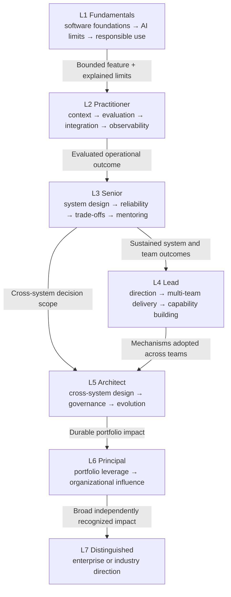
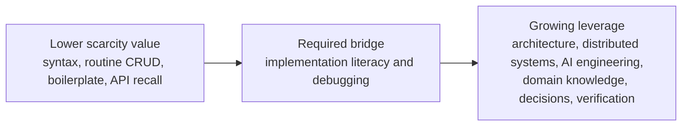

# AI Career Roadmap

| Learning metadata | Value |
|---|---|
| Career level | All levels |
| Topics | AI-career, skill-progression |
| Purpose | Identify the next capability and evidence gate |
| Importance | Important |

Use this role-neutral map to choose the next capability and its evidence gate. Skills are ordered by leverage; tools remain optional implementation choices.

| Level | Primary capability | Evidence gate |
|---|---|---|
| L1 Fundamentals | Software delivery, AI limitations, prompting basics, responsible use | Deliver a bounded AI feature, explain limitations, and show tests |
| L2 Practitioner | Context engineering, evaluation, integration, traceability, human oversight | Own an evaluated workflow with production-relevant operational evidence |
| L3 Senior | AI system design, trade-offs, evaluation strategy, mentoring, incident learning | Sustain system and team outcomes across more than one context |
| L4 Lead | Direction, decomposition, multi-team alignment, delivery governance, capability building | Teams improve through mechanisms that persist without constant author support |
| L5 Architect | Cross-system architecture, adoption framing, governance mechanisms, economics, operating model | Architecture is adopted across teams and produces measured outcomes |
| L6 Principal | Portfolio strategy, reusable mechanisms, long-horizon planning, senior-leader development | Demonstrate durable impact beyond one program |
| L7 Distinguished | Enterprise or industry direction, original practice, succession and external contribution | Demonstrate broad, sustained, independently recognized impact |

## What AI changes

The left-hand skills remain necessary, but generation makes them easier to produce. Career leverage shifts toward framing, consequence-aware design, domain judgment, and verification. Engineers must still read, debug, secure, and operate generated implementation.

## Use the roadmap

1. Select a target role and level.
2. Preserve competencies already supported by evidence.
3. Identify the first missing high-leverage capability.
4. Choose work that produces reviewable evidence for that gap.
5. Advance only when the gate is sustained at the required scope.
