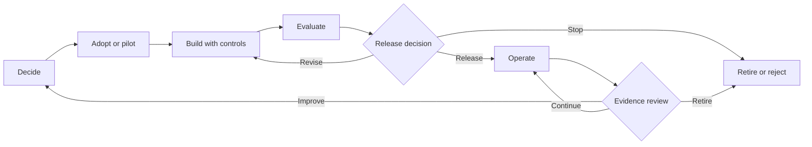
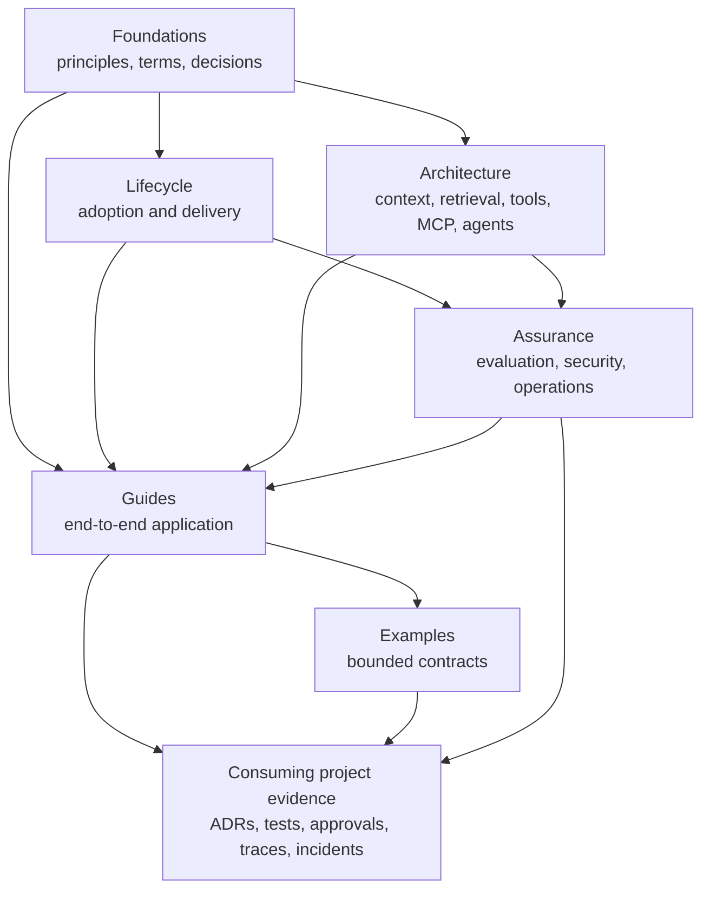

# Playbook Diagrams

These diagrams show how the playbook fits together. They describe document responsibilities, not a deployable system architecture.

## Decision and operating lifecycle

Use:

- [System decision guide](foundations/system-decision-guide.md) for **Decide**.
- [Adoption and governance](lifecycle/adoption-and-governance.md) for **Adopt or pilot**.
- [AI-assisted delivery](lifecycle/ai-assisted-delivery.md) and architecture references for **Build**.
- [Evaluation and release](assurance/evaluation-and-release.md) for **Evaluate** and **Release decision**.
- [Observability and operations](assurance/observability-and-operations.md) for **Operate** and evidence review.

## Capability and evidence map

The playbook defines reusable questions and gates. Only the consuming project can produce evidence that its implementation passes them.
