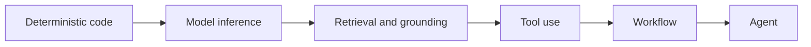

# AI Concepts in Plain English

| Field | Value |
|---|---|
| Status | Stable |
| Audience | Software engineers and technical reviewers who are new to production AI systems |
| Decision supported | Which system capability is actually needed and what new responsibility it introduces |
| Applies when | Terms such as inference, context, RAG, tool, workflow, agent, MCP, or evaluation are still blurry |
| Does not apply when | An exact repository definition is needed; use the glossary instead |
| Expected output | A shared mental model and a pointer to the relevant decision guide |
| Evidence basis | Repository contracts plus official protocol, security, risk, and observability references |
| Last reviewed | 2026-07-04 |

Use one example throughout: a developer asks an internal assistant, “Which deployment policy applies to this service?” The safest useful design depends on what the assistant must know and do.

## Start with the smallest shape



Moving right adds capability, but also adds failure modes, testing work, security boundaries, and operating cost. This is a classification aid, not a maturity ladder: an agent is not inherently better than deterministic code.

## Model inference: generate a proposal

**Plain meaning:** send input to a model and receive probabilistic output.

For the policy question, a model might explain a policy clearly, but it may also recall an outdated rule or invent one. Treat the answer as a proposal, not stored truth or authorized action.

Use it when the task benefits from language understanding or generation and the output can be checked or safely refused. Start with the [system decision guide](system-decision-guide.md).

## Context: what the model can see now

**Plain meaning:** the instructions and authorized information assembled for one model call.

If the request includes the service name, the current policy excerpt, and the required answer format, those items are context. Context is temporary. It is not automatically durable memory, and more context is not always better: irrelevant or conflicting text can reduce answer quality.

## Retrieval and RAG: look up evidence before answering

**Plain meaning:** search approved sources, place selected passages into context, then ask the model to answer from them. This pattern is commonly called retrieval-augmented generation, or RAG.

For the policy question, retrieval can find the current deployment policy and return a link with the answer. It does not prove the answer is correct. The source may be stale, access control may be wrong, or retrieval may select the wrong passage.

The added responsibilities are source approval, authorization, freshness, citation, deletion, and retrieval evaluation. See [context, retrieval, and knowledge](../architecture/context-retrieval-and-knowledge.md) and the [grounded-answer example](../examples/grounded-answer.md).

## Grounding: make support inspectable

**Plain meaning:** constrain and assess an answer against identified evidence.

A grounded answer says which policy version supports the conclusion and abstains when support is missing. A citation is useful evidence, but a link alone is not grounding if the linked text does not support the claim.

## Tool: let the system request an operation

**Plain meaning:** a typed adapter exposes a bounded capability such as reading deployment status or creating an approval request.

The model may propose `get_deployment_status(service_id)`. Deterministic code still validates the arguments, checks the caller's authority, executes the operation, and records the outcome. A tool description helps selection; it is not an authorization rule.

See [tools, MCP, memory, and orchestration](../architecture/tools-mcp-and-orchestration.md).

## MCP: a protocol boundary, not a trust boundary

**Plain meaning:** Model Context Protocol standardizes how a client and server exchange tools, resources, and prompts.

MCP can make a policy-search capability discoverable to different clients. Compatibility does not make the server safe, the data authorized, or a requested operation approved. Those remain system responsibilities. The [official MCP introduction](https://modelcontextprotocol.io/docs/getting-started/intro) is the easiest next read; use the [specification](https://modelcontextprotocol.io/specification/) when implementing protocol behavior.

## Workflow: known steps and transitions

**Plain meaning:** an explicit sequence or graph controls how work moves from request to result.

The policy assistant might follow `identify service → retrieve policy → validate citation → draft answer → request human review`. The transitions are known even if one step uses a model. A workflow is usually easier to test and operate than an agent when the path is predictable.

## Agent: bounded runtime planning

**Plain meaning:** the runtime can choose or revise steps while pursuing a goal within configured capabilities, policy, budget, and stopping rules.

An agent may be justified if the policy question requires exploring several changing systems and revising the search plan. It is unnecessary when one retrieval query and one answer step are enough.

“Agent” should trigger questions about available tools, authority, budgets, termination, traceability, recovery, and evaluation—not an assumption of autonomy. See [agent runtime](../architecture/agent-runtime.md) and the [bounded-agent example](../examples/bounded-research-agent.md).

## Memory: governed state across runs

**Plain meaning:** information deliberately stored and retrieved beyond one temporary context.

Remembering that a user owns a service may save time, but ownership changes. Memory therefore needs provenance, access control, correction, retention, and deletion. A conversation window or cached prompt is not automatically a safe memory design.

## Evaluation: test behavior against owned criteria

**Plain meaning:** run versioned cases and compare results with thresholds chosen by an accountable owner.

For the policy assistant, useful cases include a current policy, an obsolete policy, conflicting sources, a service the user cannot access, and a question with no supporting document. “The demo looked right” is not an evaluation result.

Evaluation is broader than model accuracy: it can cover retrieval, tool selection, denied actions, workflow recovery, safety, latency, and cost. See [evaluation and release](../assurance/evaluation-and-release.md).

## The complete example

```text
Question
  -> authorize the requester and service
  -> retrieve current approved policy passages
  -> generate an answer constrained to those passages
  -> validate citation and output shape
  -> abstain or escalate when evidence is missing
  -> record version, outcome, latency, and failure signals
```

This example needs inference, context, retrieval, grounding, deterministic validation, and evaluation. It does not need a write-capable tool, durable memory, or an agent unless additional requirements justify them.

## What to read next

- Need to choose the shape? Use the [system decision guide](system-decision-guide.md).
- Need exact meanings? Use the [glossary](glossary.md).
- Need one end-to-end application? Use the [bounded workflow guide](../guides/take-a-bounded-ai-workflow-to-release.md).
- Need approachable external material? Use the annotated [references](../references/README.md); they are optional follow-up, not required reading before using the playbook.
