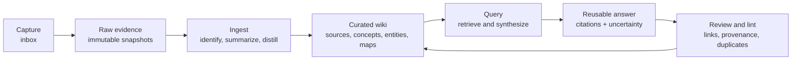

# Build an LLM Wiki as a Second Brain

| Learning metadata | Value |
|---|---|
| Career level | L2 Practitioner |
| Topics | RAG, second-brain |
| Purpose | Build a provenance-first learning system |
| Importance | Important |

| Field | Value |
|---|---|
| Status | Stable |
| Audience | Engineers who want a local, source-grounded learning system maintained with an LLM |
| Decision supported | How to build a durable second brain without confusing generated notes, semantic retrieval, and authoritative sources |
| Applies when | Knowledge must compound across sources, projects, and repeated questions with inspectable provenance |
| Does not apply when | A document folder, ordinary search, or a managed notebook already satisfies the outcome |
| Expected output | An initialized wiki, one ingested source, one grounded query, a clean maintenance review, and reviewable skill evidence |
| Evidence basis | The retired `ai-llm-wiki` engine, its dogfood workspace, and this repository's retrieval and verification contracts |
| Last reviewed | 2026-07-05 |

An LLM wiki is not merely a folder of generated summaries. It is a controlled transformation from immutable evidence into navigable knowledge and reusable, source-grounded answers.

## Mental model



The layers have different authority:

- `inbox/` is temporary capture and may be incomplete.
- `raw/` preserves authorized source material or a dated source snapshot.
- `wiki/` is a curated retrieval layer; it is derived and correctable.
- `wiki/queries/` stores useful syntheses, not new source truth.
- repository files may be cited directly when path and revision are recorded.

This differs from query-time RAG alone. RAG can retrieve fragments for one answer; a second brain also preserves durable concepts, relationships, maps, corrections, and prior useful questions so knowledge compounds.

## Decide whether to build it

Use an LLM wiki when all are true:

1. Questions recur or build on earlier learning.
2. Sources must remain inspectable.
3. Relationships across sources matter.
4. Someone will curate duplicates, contradictions, stale claims, and broken links.

Prefer ordinary files and search when the corpus is small and exact lookup is enough. Prefer a governed enterprise knowledge system when tenant isolation, legal retention, centralized access policy, or high-scale serving is the primary problem.

## Prerequisites

- Python 3.
- A Git repository or local project directory.
- The Codex `llm-wiki` skill installed under `$CODEX_HOME/skills/llm-wiki` (normally `~/.codex/skills/llm-wiki`).
- Permission to store every imported source.
- Optional: Obsidian for browsing Markdown and `[[wikilinks]]`.

The initializer creates missing files and directories but does not overwrite existing files.

## Setup commands

Set the skill location once:

```bash
export CODEX_HOME="${CODEX_HOME:-$HOME/.codex}"
export LLM_WIKI_INIT="$CODEX_HOME/skills/llm-wiki/scripts/init_llm_wiki.py"
test -f "$LLM_WIKI_INIT"
```

Purpose: make the command portable across shells and fail before changing a workspace if the skill is unavailable.

Initialize the current repository:

```bash
python3 "$LLM_WIKI_INIT" .
```

Purpose: create the operating guide, agent rules, prompts, templates, indexes, and these layers:

```text
inbox/     temporary capture
raw/       immutable evidence
wiki/      curated retrieval and durable knowledge
prompts/   repeatable ingest, query, and distillation instructions
templates/ note schema
docs/      operating guide
```

Initialize a new standalone second brain:

```bash
mkdir my-second-brain
cd my-second-brain
git init
python3 "$LLM_WIKI_INIT" .
```

Purpose: create a dedicated knowledge repository when the material spans several projects rather than explaining one codebase.

Initialize and snapshot selected local sources:

```bash
python3 "$LLM_WIKI_INIT" . --import README.md docs/architecture.md
```

Purpose: copy sources into `raw/imported/` without overwriting an existing snapshot. Import only files that the repository is authorized to retain.

Verify the generated shape:

```bash
test -f AGENTS.md
test -f docs/llm-wiki-playbook.md
test -f prompts/ingest-source.md
test -f prompts/query-wiki.md
test -f wiki/index.md
test -d raw
test -d wiki/sources
test -d wiki/concepts
test -d wiki/entities
test -d wiki/queries
```

Purpose: prove that the retrieval and maintenance surfaces exist. File presence confirms setup only—not knowledge quality.

## Run the operating loop

### 1. Capture

Put rough thoughts in `inbox/`. Do not promote them to facts merely because an LLM rewrites them cleanly.

For a remote GitHub or MCP discovery that will support a durable conclusion, record repository, path or URL, branch/ref, capture date, and observed content in `raw/github/` or a source card.

### 2. Ingest

Ask Codex to follow `prompts/ingest-source.md`, for example:

```text
Ingest raw/imported/README.md using prompts/ingest-source.md.
Show the source card, summary, concepts, entities, index changes, and provenance.
Do not modify the raw source.
```

An acceptable ingest:

- hashes or otherwise identifies the source snapshot;
- searches existing notes before creating new ones;
- creates a source card and concise summary;
- extracts focused concepts and relevant entities;
- links maps and indexes;
- separates sourced statements from inference;
- reports conflicts and curation needed.

### 3. Query

Ask a question through the query prompt:

```text
Using prompts/query-wiki.md, answer:
What architecture decisions does this repository currently support?
Use only wiki-supported evidence, cite the source paths, and state missing evidence.
Save the answer only if it will be reused.
```

Good retrieval is not “the vector result looked related.” The answer must resolve to evidence that supports the material claims. When exact identifiers, dates, or contractual wording matter, combine semantic discovery with lexical search and metadata filters.

### 4. Distill

Use `prompts/distill-concepts.md` when a summary contains several reusable ideas. Keep one durable idea per concept note. Link rather than copy shared explanations.

### 5. Review and lint

Run a weekly review:

1. Empty `inbox/` by deleting, archiving, or processing each item.
2. Resolve broken Markdown links and Obsidian wikilinks.
3. Find duplicate titles, slugs, concepts, and entities.
4. Check that important claims resolve to authorized sources.
5. Review contradictions, stale sources, orphan notes, and missing indexes.
6. Add useful cross-links only when the relationship helps retrieval.
7. Record meaningful maintenance in `wiki/log.md`.

Useful mechanical checks:

```bash
git status --short
find raw wiki -type f -name '*.md' | sort
rg -n 'TODO|TBD|missing evidence|inference' wiki
rg -n '\[\[[^]]+\]\]' wiki
```

These commands expose candidates for review; they do not prove that links resolve or claims are true. A proper lint must validate schema, paths, provenance, duplicates, indexes, and source immutability.

## RAG design lessons

1. **Preserve evidence before embedding.** An index is derived state and must be rebuildable.
2. **Chunk by meaning.** Preserve the section, procedure, record, or code symbol needed to judge a claim.
3. **Metadata is part of retrieval.** Source, revision, date, owner, sensitivity, and access scope often matter more than semantic closeness.
4. **Hybrid retrieval is normal.** Semantic similarity helps paraphrases; lexical search protects exact names and wording.
5. **Generated structure can compound value.** Concepts, maps, and saved queries reduce repeated rediscovery—but they also create maintenance obligations.
6. **Provenance beats confidence.** A fluent answer without inspectable support remains a proposal.
7. **Lint is knowledge operations.** Broken links, duplicates, stale sources, and unsupported claims are operational failures of the second brain.

## Failure handling

- If evidence is absent, report the gap instead of completing the answer from model memory.
- If sources conflict, preserve both claims, identify authority and revision, and request an owner decision.
- If a source changes, capture a new revision; do not silently rewrite the old snapshot.
- If private or unauthorized data was ingested, stop processing, remove derived copies under the applicable policy, and record what requires remediation.
- If the wiki becomes a dumping ground, pause ingestion and repair maps, duplicates, source coverage, and query usefulness before adding scale or embeddings.

## Capability evidence

Completing the setup does not prove LLM, RAG, or second-brain skill. Use the [LLM, RAG, and second-brain capability checklist](../career/llm-rag-second-brain-capability.md) to produce reviewable evidence.

## Related guidance

- [Context, retrieval, and knowledge](../architecture/context-retrieval-and-knowledge.md)
- [Concepts in plain English](../foundations/concepts-in-plain-english.md)
- [Evaluation and release](../assurance/evaluation-and-release.md)
- [Career project evidence](../career/project-evidence.md)
